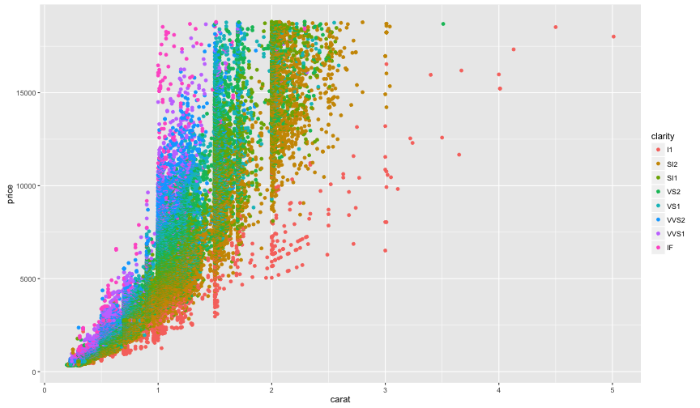

1. Project Pitch / Data Products
========================================================
author: Herminio Vazquez
date: November 5, 2016
autosize: true

2. App Introduction
========================================================

If you are about to get married, you need to know the features
influencing the prices on diamond. The application shown in this project
assist you undertanding the following:

- Price ranges
- Diamond features
- Diamond lingo

3. Data origins
========================================================

The features described in the dataset are:

```r
library(ggplot2)
names(diamonds)
```

```
 [1] "carat"   "cut"     "color"   "clarity" "depth"   "table"   "price"  
 [8] "x"       "y"       "z"      
```

Your investment will be around:

```r
summary(diamonds$price)
```

```
   Min. 1st Qu.  Median    Mean 3rd Qu.    Max. 
    326     950    2401    3933    5324   18820 
```

4. Our app will show you something like:
========================================================



5. Please visit at
========================================================

Thanks for supporting us. (me)
Our app is located in:

[Data Products - Final Submission App](https://herminio.shinyapps.io/Coursera-DataProduct-Week4/)


